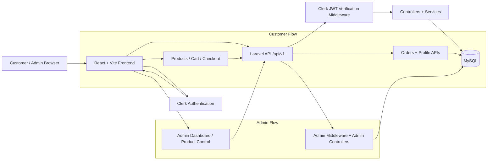

# XETA

XETA is a D2C e-commerce platform for computer peripherals.

The project is split into:
- `frontend/`: React + Vite client with Clerk authentication.
- `backend/`: Laravel API for products, cart, orders, profile, and admin operations.

## Tech Stack

- Frontend: React, Vite, React Router, Clerk, Axios
- Backend: Laravel 12, Eloquent ORM, API Resources, Form Requests
- Database: MySQL
- Payments: Cash on Delivery

## Core Features

- Customer catalog browsing and filtering
- Cart and COD checkout flow
- User profile and account settings
- Role-based admin dashboard
- Product and variant management for admins

## Architecture Flowchart

## Request Flow

1. User signs in via Clerk on the frontend.
2. Frontend attaches Clerk token to API requests.
3. Laravel middleware validates JWT and resolves/creates the user.
4. Controllers delegate business logic to services.
5. Responses are returned via API resources to the frontend UI.

## Local Development

### Backend

1. Go to `backend/`
2. Install dependencies
3. Configure `.env`
4. Run migrations and seeders
5. Start Laravel server

### Frontend

1. Go to `frontend/`
2. Install dependencies
3. Configure Clerk and API env vars
4. Start Vite dev server

## Environment Variables (high-level)

### Frontend

- `VITE_CLERK_PUBLISHABLE_KEY`
- `VITE_API_URL`

### Backend

- `CLERK_SECRET_KEY` / Clerk-related config
- DB connection values
- Standard Laravel app settings

## API Scope (Summary)

- Public: products, categories
- Authenticated: cart, checkout, orders, profile
- Admin: dashboard, products, variants, admin order operations

## Notes

- Admin and customer experiences are role-scoped.
- COD is the active payment strategy.
- UI supports light and dark themes.
