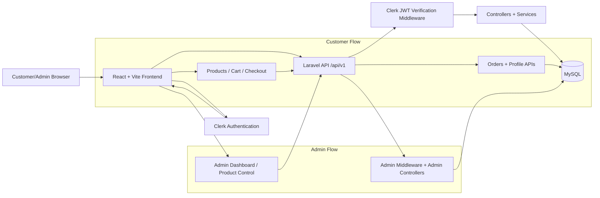

# XETA

<div align="center">

XETA

**D2C e-commerce platform for computer peripherals (customer + admin).**

[](#tech-stack)
[](#tech-stack)
[](#tech-stack)
[](#tech-stack)
[](backend/composer.json)

Catalog browsing · Cart and checkout · Role-based admin panel · Clerk auth · Theme support

</div>

## Tech Stack

### Frontend
- React 19
- Vite 8
- React Router DOM 7
- Clerk React
- Axios
- Leaflet + React Leaflet
- ESLint 9

### Backend
- Laravel 12 (API-first)
- PHP 8.2+
- Eloquent ORM
- Form Requests + API Resources
- Firebase PHP JWT

### Data and Infra
- MySQL 8
- Cash on Delivery payment flow
- Local dev with npm + Composer

## Directory Map

```text
Xeta/
├─ README.md
├─ CHANGELOG.md
├─ backend/
│  ├─ app/
│  │  ├─ Http/
│  │  │  ├─ Controllers/
│  │  │  ├─ Middleware/
│  │  │  ├─ Requests/
│  │  │  └─ Resources/
│  │  ├─ Models/
│  │  └─ Services/
│  ├─ bootstrap/
│  ├─ config/
│  ├─ database/
│  │  ├─ factories/
│  │  ├─ migrations/
│  │  └─ seeders/
│  ├─ routes/
│  ├─ tests/
│  ├─ composer.json
│  └─ artisan
└─ frontend/
   ├─ public/
   ├─ src/
   │  ├─ assets/
   │  ├─ components/
   │  ├─ pages/
   │  ├─ App.jsx
   │  └─ main.jsx
   ├─ package.json
   └─ vite.config.js
```

## Core Features

- Product browsing by category and filters
- Cart management with quantity updates
- Cash on Delivery checkout
- Customer account and order history
- Admin dashboard and product management
- Variant and inventory-oriented product forms
- Light and dark theme support

## Architecture Flowchart



## Setup Guide

### 1) Prerequisites

- Node.js 18+
- npm 9+
- PHP 8.2+
- Composer 2+
- MySQL 8+

### 2) Clone and enter project

```bash
git clone https://github.com/jethrosantiago26/xeta.git
cd Xeta
```

### 3) Backend setup (Laravel API)

```bash
cd backend
composer install
cp .env.example .env
php artisan key:generate
```

Update your backend .env database and Clerk values before running migrations.

Required backend variables (minimum):
- APP_URL
- DB_CONNECTION, DB_HOST, DB_PORT, DB_DATABASE, DB_USERNAME, DB_PASSWORD
- CLERK_SECRET_KEY

### 4) Database migration and seeding

Run initial migrations:

```bash
php artisan migrate
```

Run all configured seeders:

```bash
php artisan db:seed
```

Run migrate + seed in one command:

```bash
php artisan migrate --seed
```

Reset database and reseed from scratch (useful during development):

```bash
php artisan migrate:fresh --seed
```

Seed a specific seeder only (example):

```bash
php artisan db:seed --class=CategorySeeder
```

Current seeder entrypoint:
- backend/database/seeders/DatabaseSeeder.php

### 5) Start backend server

```bash
php artisan serve --host=127.0.0.1 --port=8000
```

### 6) Frontend setup (React + Vite)

In a new terminal:

```bash
cd frontend
npm install
```

Create frontend .env (or .env.local) and set:
- VITE_CLERK_PUBLISHABLE_KEY
- VITE_API_URL=http://127.0.0.1:8000/api/v1

Start frontend dev server:

```bash
npm run dev -- --host 127.0.0.1 --port 5173 --strictPort
```

### 7) Access app

- Frontend: http://127.0.0.1:5173
- Backend API: http://127.0.0.1:8000

## API Scope Summary

- Public: products, categories
- Authenticated: cart, checkout, orders, profile
- Admin: dashboard, products, variants, order operations

## Notes

- Clerk manages authentication in frontend.
- Laravel verifies Clerk JWT and resolves/creates local users.
- Admin and customer routes are role-protected.
