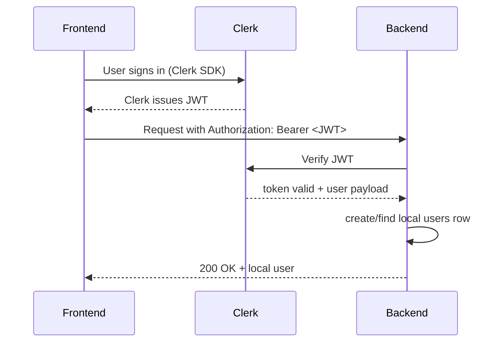
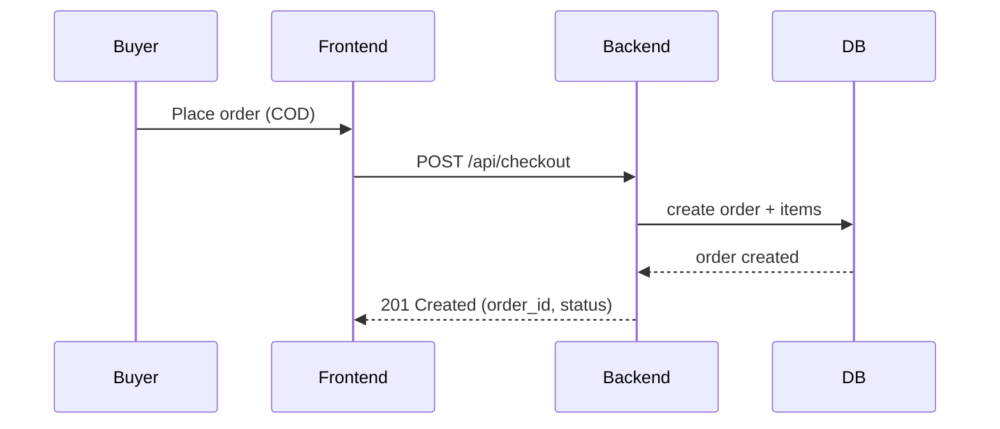

# XETA — Platform Specification (AskDoc-style)

Version: 0.1
Authors: <Your Name(s)>
Date: 2026-04-27

This document adapts the structure and thoroughness of the AskDocPH platform specification for XETA — a D2C e-commerce system for computer peripherals. Use this as the canonical specification to guide development, testing, deployment, and the final demo.

---

## Table of contents

- Overview
- Goals & success criteria
- Scope (in / out)
- Stakeholders & personas
- User stories & acceptance criteria
- Functional requirements
- Non-functional requirements
- System architecture (links)
- Data model (entities & fields)
- API surface (endpoints & examples)
- UX surface (pages & components)
- Sequence diagrams (auth, checkout)
- Security, privacy & compliance
- Deployment, environment & runbook
- Testing & QA
- Demo checklist & acceptance criteria
- Appendix: sample migrations & models

---

## 1. Overview

XETA is a lightweight direct-to-consumer e-commerce platform where small sellers can list computer peripherals and consumers can browse, order, and pay with cash-on-delivery (COD). The platform aims for quick time-to-list for sellers, a clean buying flow for customers, and a minimal admin interface for order processing.

Primary differentiator: simple seller onboarding and COD-focused checkout adapted to local preferences.

---

## 2. Goals & success criteria

Goals:
- Provide a reliable product catalog with images and inventory fields.
- Enable consumers to place COD orders with minimal friction.
- Give admins a simple dashboard to manage products and orders.
- Use Clerk for secure authentication and server-side verification.

Success metrics (MVP):
- Demo flow completes within 3 minutes (buyer+admin).
- Product listing creation <= 2 minutes for a seller.
- End-to-end checkout (buyer places order → admin marks delivered) working in demo environment.

---

## 3. Scope

In scope (MVP):
- Product catalog (list, detail, images, variants)
- Search & basic filters
- Cart, COD checkout, order creation
- User sign-in with Clerk (server verifies JWT and creates local `users` record)
- Admin: product CRUD, order list with statuses
- Image uploads with S3-compatible storage (local fallback)

Out of scope (MVP):
- Third-party card payments (future work)
- Multi-vendor billing & payouts
- Recommendation engine, analytics dashboards

---

## 4. Stakeholders & personas

- Alice — Shopper (student): browses, compares prices, prefers COD.
- Ben — Seller: lists peripherals, manages inventory and orders.
- Carla — Admin/IT: monitors orders, resolves disputes, manages products.
- Instructor / Panelist: evaluates the demo and inspects architecture.

---

## 5. User stories & acceptance criteria

Buyer stories:
- As a buyer, I can browse the product catalog so that I can find items to purchase.
  - Acceptance: GET /api/products returns paginated results with images and price.
- As a buyer, I can add items to a cart and place an order with COD.
  - Acceptance: POST /api/checkout returns an order with `status: pending` and an `order_id`.

Seller / Admin stories:
- As an admin, I can create and update products.
  - Acceptance: POST/PUT admin endpoints return 201/200 and the updated product object.
- As an admin, I can view and update order statuses.
  - Acceptance: Admin order list shows recent orders and allows status transitions (pending→processing→delivered).

Authentication stories:
- As a user, I can sign in using Clerk.
  - Acceptance: frontend can sign in and calls protected APIs with `Authorization: Bearer <Clerk_JWT>`; backend accepts verified tokens and returns local `user` record.

---

## 6. Functional requirements (selected)

6.1 Product Catalog
- List: `/api/products` (search, filter, pagination)
- Detail: `/api/products/{id}` with images, variants, description
- Admin CRUD: `/api/admin/products`

6.2 Cart & Checkout
- Cart endpoints to add/update/remove items
- Checkout endpoint accepts shipping and `payment_method: COD`
- Order lifecycle: pending → processing → delivered → cancelled

6.3 Users & Auth
- Clerk-based authentication: client SDK for frontend, JWT verification server-side
- Local `users` table stores `id`, `clerk_id`, `email`, `name`, `role`

6.4 Admin Panel
- Product management, order list with search and filters, order detail and status changes

6.5 Uploads
- Signed uploads to S3-compatible storage in production; multipart/form local fallback in dev

---

## 7. Non-functional requirements

- Performance: list requests respond <200ms for cached data; paginated responses.
- Availability: single-region deploy with automated restarts; acceptable for class demo.
- Security: all protected endpoints require JWT verification; admin routes require `role=admin`.
- Data retention: orders retained for 2 years by default; PII limited to email, name, shipping address.
- Observability: request logs, error logs, basic metrics for 90 days.

---

## 8. System architecture

See [docs/architecture.md](architecture.md) for a readable diagram. Key points:
- Frontend: React + Vite (Vercel)
- Backend API: Laravel (Railway)
- DB: MySQL
- Storage: S3-compatible
- Auth: Clerk client + server

---

## 9. Data model (entities & core fields)

users
- id (int, PK)
- clerk_id (string, unique)
- email (string)
- name (string)
- role (enum: admin, customer)
- created_at, updated_at

products
- id (int, PK)
- sku (string)
- title (string)
- description (text)
- price (integer, cents)
- currency (string)
- stock (int)
- metadata (json)
- created_at, updated_at

orders
- id (int, PK)
- user_id (FK users)
- total (int)
- status (enum)
- payment_method (string)
- shipping (json)
- created_at, updated_at

order_items
- id, order_id, product_id, qty, unit_price

images
- id, model_type, model_id, url, alt_text

ERD (simple ASCII):

```
users 1---* orders
orders 1---* order_items *---1 products
products 1---* images
```

---

## 10. API surface (examples)

Base path: `/api`

Auth
- POST `/api/auth/verify`
  - Header: `Authorization: Bearer <Clerk_JWT>`
  - Response: `{ user: {...} }`

Products
- GET `/api/products?page=1&per_page=12&search=keyboard`
  - Response: 200 `{ data: [...], meta: { page, per_page, total } }`
- GET `/api/products/{id}`
- POST `/api/admin/products` (admin only)

Cart
- GET `/api/cart`
- POST `/api/cart/items` `{ product_id, qty }`

Checkout
- POST `/api/checkout`
  - Body: `{ cart_id, shipping: {...}, payment_method: "COD" }`
  - Response: 201 `{ order: { id, status: "pending", total } }`

Orders
- GET `/api/orders` (user)
- GET `/api/admin/orders` (admin)
- PUT `/api/admin/orders/{id}/status` `{ status: "processing" }`

Uploads
- POST `/api/uploads` multipart-form or signed URL flow

Notes: Use consistent HTTP status codes and JSON error payloads: `{ "errors": [{ "field": "...", "message": "..." }] }`.

---

## 11. UX surface — pages & components

Pages:
- Home / Catalog (search & filters)
- Product detail
- Cart & Checkout
- Sign-in / Profile
- Admin: Dashboard, Products, Orders, Uploads

Reusable components:
- ProductCard, ProductList, ImageCarousel
- CartWidget, CheckoutForm
- AdminTable, StatusPill

Accessibility: keyboard focus, alt text on images, labels on forms.

---

## 12. Sequence diagrams (mermaid)

Auth verification (frontend → backend):



Checkout flow:



---

## 13. Security & privacy

- Protect admin endpoints with role-based middleware.
- Verify Clerk JWTs on every protected request.
- Sanitize user input and validate file uploads (max size, allowed types).
- Store only required PII (email, name, shipping) and follow retention policy.
- Use HTTPS in production and secure environment variables.

---

## 14. Deployment & environment

Environment variables (examples):
- CLERK_PUBLISHABLE_KEY
- CLERK_SECRET_KEY
- VITE_CLERK_PUBLISHABLE_KEY
- DB_HOST, DB_DATABASE, DB_USERNAME, DB_PASSWORD
- S3_ENDPOINT, S3_KEY, S3_SECRET, S3_BUCKET

Deployment targets:
- Frontend: Vercel (preview and production)
- Backend: Railway (or Heroku-like service)

CI: GitHub Actions can run tests and deploy on push to `main`.

---

## 15. Testing & QA

- Backend: PHPUnit feature tests for API endpoints (auth, products, checkout)
- Frontend: unit tests for components; Cypress or Playwright for E2E demo flows (buyer + admin)
- Test data: seeders that create sample products and demo admin account

Acceptance tests (automated):
- Create product (admin), buy product (buyer), order appears in admin orders list.

---

## 16. Monitoring & runbook

- Logs: Railway & Vercel logs, rotate and retain for 90 days for demo purposes
- Alerts: simple uptime alert for backend endpoint
- Runbook: see `docs/demo-runbook.md` and `docs/panelist-guide.md` for demo steps

---

## 17. Demo checklist (for panelists)

- [ ] Backend running on http://localhost:8000
- [ ] Frontend running on http://localhost:5173
- [ ] Clerk dev keys set; demo accounts seeded
- [ ] Product exists to demonstrate cart and checkout
- [ ] Admin window ready (incognito)
- [ ] PDF packet and panelist guide available (docs/XETA_Panelist_Packet.pdf)

Acceptance: Buyer places order and Admin marks it delivered during demo.

---

## 18. Next steps / roadmap

- Add card payments + refunds
- Vendor onboarding & product analytics
- Internationalization and shipping cost calculation

---

## Appendix: sample migration snippets

Example `products` migration (Laravel-like):

```php
Schema::create('products', function (Blueprint $table) {
  $table->id();
  $table->string('sku')->unique()->nullable();
  $table->string('title');
  $table->text('description')->nullable();
  $table->integer('price');
  $table->string('currency')->default('PHP');
  $table->integer('stock')->default(0);
  $table->json('metadata')->nullable();
  $table->timestamps();
});
```

Example `orders` structure (simplified):

```php
Schema::create('orders', function (Blueprint $table) {
  $table->id();
  $table->foreignId('user_id')->constrained('users');
  $table->integer('total');
  $table->string('status')->default('pending');
  $table->string('payment_method');
  $table->json('shipping')->nullable();
  $table->timestamps();
});
```

---

If you'd like, I can:
- Convert this to a styled PDF (Pandoc + LaTeX) for a prettier packet;
- Generate a compact one-page handout for the panelists;
- Create an OpenAPI 3.0 JSON/YAML from the API section;
- Add example Postman collection or Cypress E2E test for the demo.

Which of these should I do next?